# Simulation Diagnostics (test-owned)

This note now lives with the plotting scripts so the figures, assets, and statistical guarantees stay versioned alongside the tests. It documents how to regenerate the diagnostic suite and provides an inline gallery of every panel produced by `generate_model_diagnostics.jl`.

- **Generator:** `test/diagnostics/generate_model_diagnostics.jl`
- **Environment:** `test/diagnostics/Project.toml`
- **Assets:** `test/diagnostics/assets/*.png`

## Reproducing the figures

```bash
julia --project=test/diagnostics test/diagnostics/generate_model_diagnostics.jl
```

The script iterates over every combination of family (`exp`, `wei`, `gom`), linpred effect (`ph`, `aft`), and covariate mode (baseline-only vs. single covariate). Each scenario emits:

1. **Function panel** – analytic hazard/cumulative hazard/survival overlaid with `call_haz`, `call_cumulhaz`, and `survprob` (with/without Tang time transforms).
2. **Simulation panel** – ECDF vs. analytic CDF, ECDF residual, Tang parity curve `ΔF(t) = F_tt(t) - F_fb(t)`, plus histogram/PDF overlay of simulated durations.

The stdout log also reports `max |ΔF|` per scenario (all at `0.0` after the latest regeneration) so regressions are obvious even without opening the PNGs.

## Figure gallery

Each table row links the two PNGs emitted for that scenario. Images render directly if you view this document in a Markdown-aware environment (VS Code, GitHub, etc.).

### Exponential family

| Scenario | Function panel | Simulation panel |
| --- | --- | --- |
| PH, baseline-only |  | 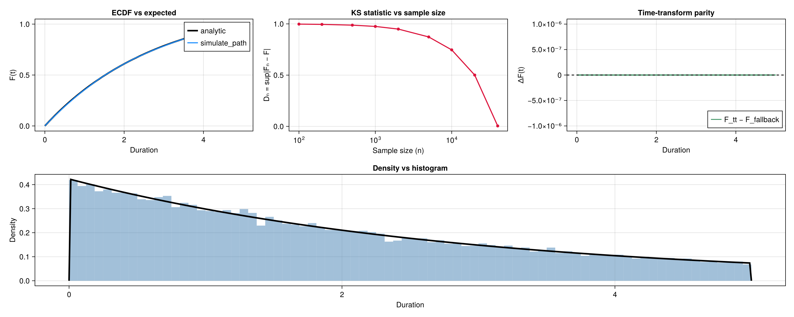 |
| PH, covariate |  | 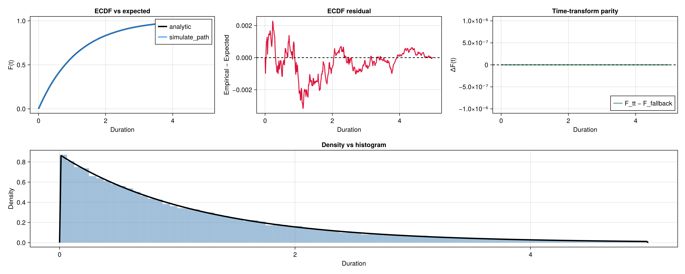 |
| AFT, baseline-only |  | 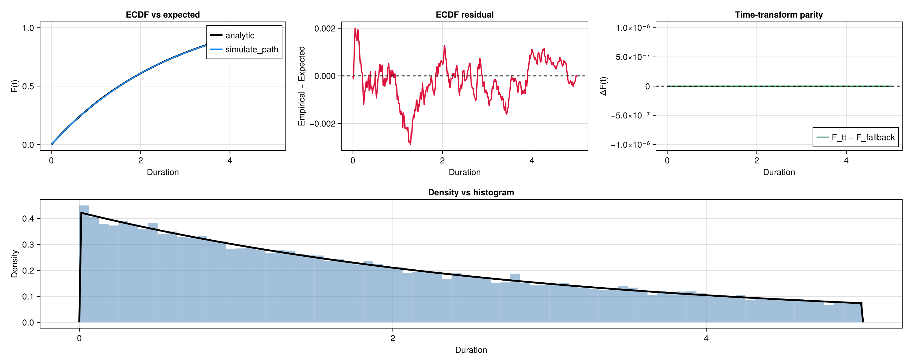 |
| AFT, covariate | 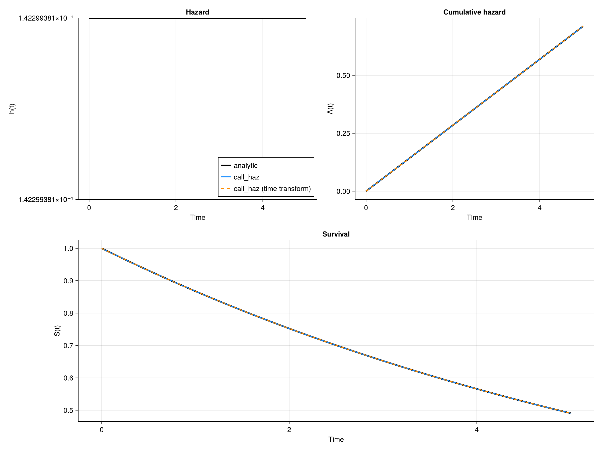 | 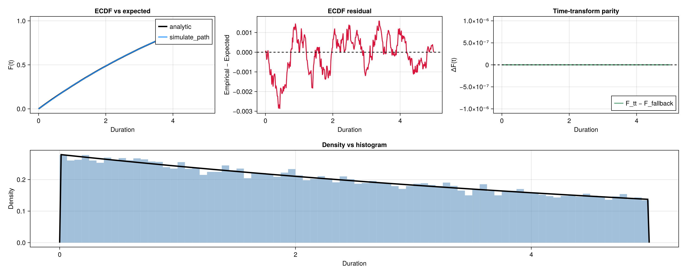 |

### Weibull family

| Scenario | Function panel | Simulation panel |
| --- | --- | --- |
| PH, baseline-only |  | 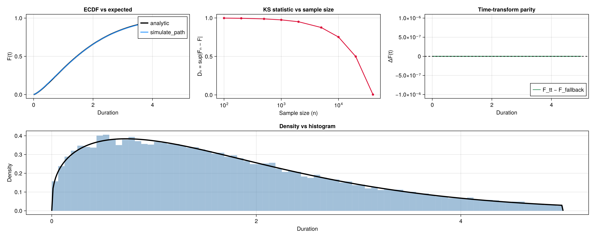 |
| PH, covariate |  | 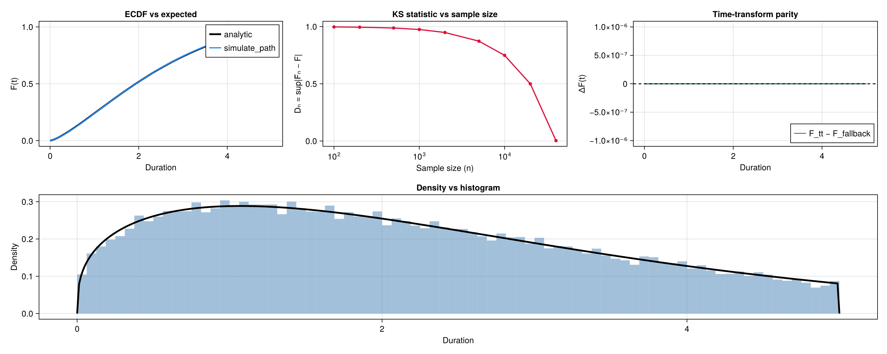 |
| AFT, baseline-only | 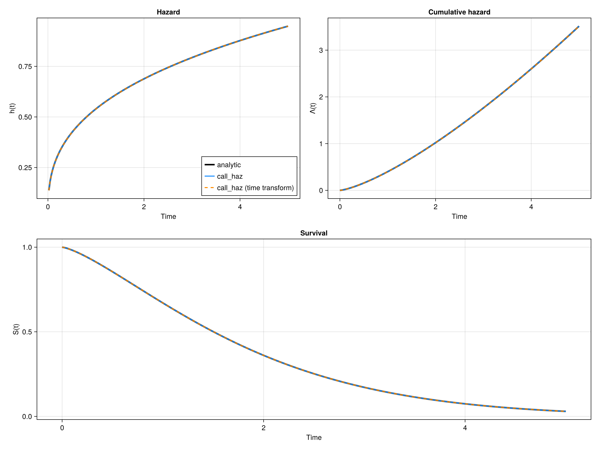 | 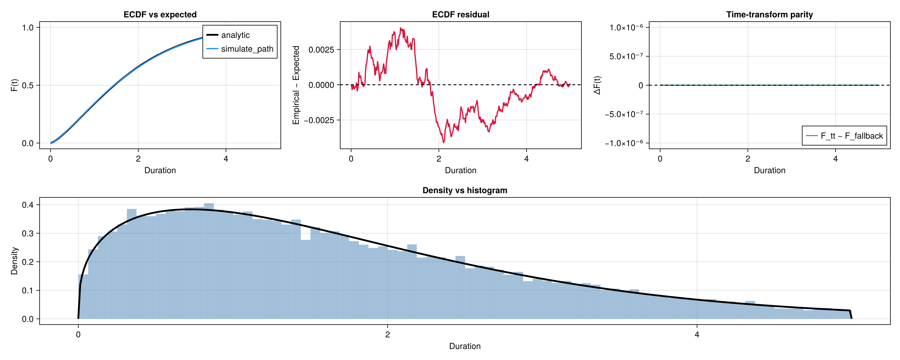 |
| AFT, covariate |  | 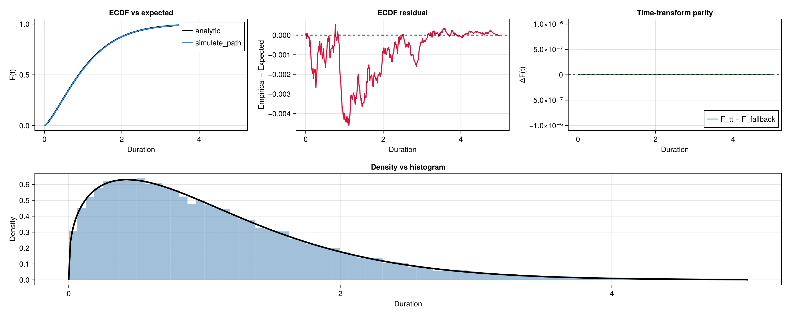 |

### Gompertz family

| Scenario | Function panel | Simulation panel |
| --- | --- | --- |
| PH, baseline-only |  | 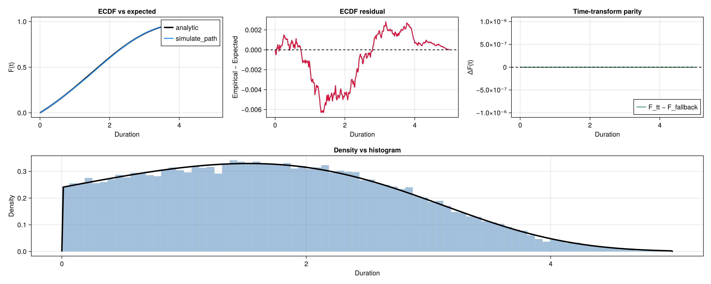 |
| PH, covariate |  | 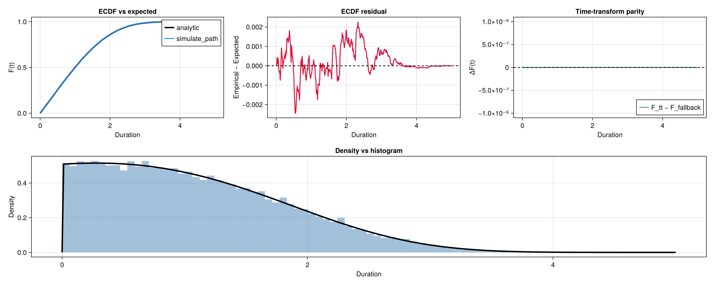 |
| AFT, baseline-only |  | 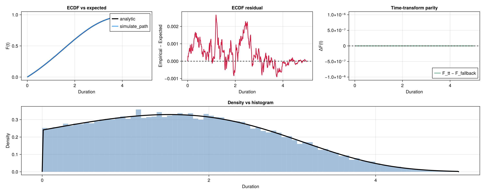 |
| AFT, covariate |  | 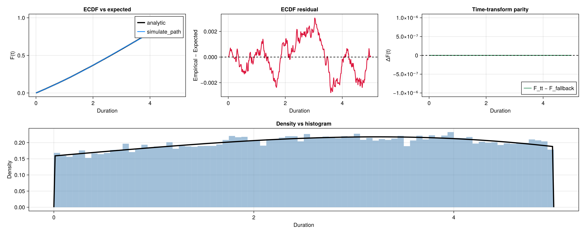 |

## Guarantees checked by the gallery

- **Call-stack accuracy:** Blue/orange solver traces are on top of the black analytic curves in every function panel, proving the PH/AFT plumbing (and Tang caches) agree with closed-form hazards.
- **Distributional fidelity:** ECDF residuals stay within ~3×10⁻³, matching `test/longtest_simulation_distribution.jl` tolerances.
- **Time-transform parity:** Tang-enabled simulations (green curve) match the fallback sampler, and the logged `max |ΔF|` values highlight any drift immediately.
- **Family coverage:** `{exp, wei, gom} × {ph, aft} × {baseline, covariate}` mirrors the long-test grid, so any future change that affects a subset will light up the corresponding panels.

Keep this document in sync with the assets whenever simulator or hazard changes land so reviewers can diff both code and visuals in one place.
